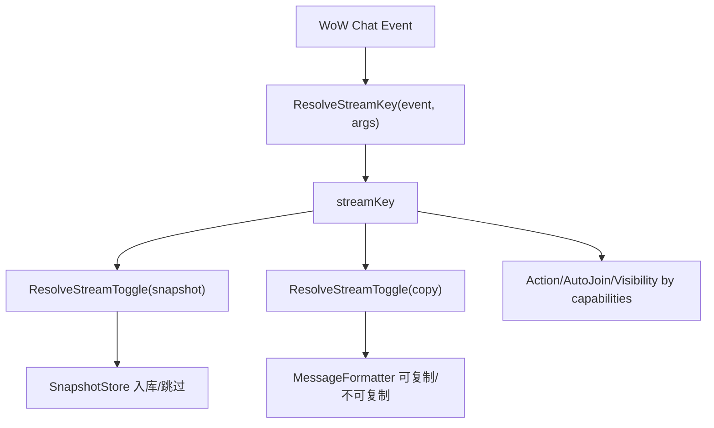

# TinyChaton 架构总览规格

## 问题/目标

提供当前核心架构视图，明确 Stream V2 在消息处理链中的位置。

## 核心层次

1. Infrastructure
- CapabilityPolicyEngine
- RuntimeMode / FeatureRegistry
- Gateway / Resolver / Validation

2. Domain Registries
- Stream Registry V2（`kind + group + capabilities`）
- Action Registry（capability 过滤绑定）
- Kit / Theme / Color registries

3. Domain Services
- Chat Ingress（EventRouter + Filters）
- Chat Render（MessageFormatter + Transformers）
- Chat Storage（SnapshotStore + Replayer）
- Automation（AutoJoin 等）
- Shelf / Settings

4. Application
- Bootstrap / Lifecycle / Container

## Stream V2 关键流

## 关键约束

- 行为判定禁止依赖路径字符串。
- 所有策略统一基于 `streamKey + capabilities`。
- NOTICE 与 CHANNEL 同模型，不同 `kind/group`。
- 非 `CHAT_MSG_CHANNEL` 事件必须唯一映射到 stream。

## 关键验收

- `notice` 分组在 UI 独立展示，不并入 `system`。
- 发送动作只在 outbound stream 出现。
- 动态能力（mute/autoJoin）只在支持能力的 stream 生效。
- 重放上限运行时硬钳制 200。
