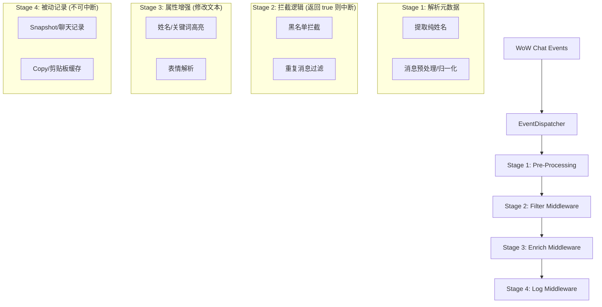

# 统一消息处理流水线架构方案

## 现状分析
目前 TinyChaton 的多个功能模块（黑名单、高亮、重复过滤、聊天记录捕获）各自独立通过 `ChatFrame_AddMessageEventFilter` 监听相同的聊天事件。

### 存在的问题
1. **性能冗余**：每条消息都会被多个模块重复解析，例如多次调用 `db.enabled` 检查、多次进行字符串小写转换和姓名解析（处理服务器后缀）。
2. **逻辑冲突**：各模块独立运作，难以实现复杂的优先级控制（例如：被黑名单拦截的消息不应进入聊天记录存储）。
3. **维护困难**：新增功能需要手动在多个地方注册事件，且容易忽略边缘情况。

---

## 优化方案：消息中间件分发系统 (Unified Pipeline)

核心思路是将 `EventDispatcher.lua` 升级为插件唯一的事件入口，将各功能模块解耦为流水线上的“中间件（Middleware）”。

### 1. 架构层次



### 2. 核心组件定义

#### 数据对象：`ChatData`
在流水线中传递的统一上下文对象：
```lua
{
    event = "CHAT_MSG_SAY",
    rawText = "...",        -- 原始文本（只读）
    text = "...",           -- 当前处理后的文本（可读写）
    author = "Player-Realm",
    name = "Player",        -- 预解析的纯姓名
    isBlocked = false,      -- 拦截标记
    metadata = {}           -- 模块间传递的自定义标签
}
```

#### 中间件注册
```lua
-- 示例：注册黑名单中间件
Dispatcher:RegisterMiddleware("FILTER", function(chatData)
    if addon:ShouldBlock(chatData) then
        return true -- 拦截
    end
end)

-- 示例：注册高亮中间件
Dispatcher:RegisterMiddleware("ENRICH", function(chatData)
    chatData.text = addon:ApplyHighlight(chatData.text)
end)
```

### 3. 预期收益
- **计算效率**：复杂的字符串解析和元数据提取仅执行一次。
- **内存占用**：减少了冗余的局部变量生成和重复的闭包引用。
- **逻辑严密性**：确保拦截逻辑优于增强逻辑，记录逻辑最后执行。

---

## 下一步实施建议
1. **重构 `EventDispatcher.lua`**：引入 `PriorityQueue` 存储中间件。
2. **重构 `Filters.lua` / `Highlight.lua`**：移除原有的 `AddMessageEventFilter` 注册，改为注册到 Dispatcher。
3. **迁移 Snapshot 逻辑**：确保聊天记录保存的是经过“增强”后（带颜色、带表情）还是原始文本，可在流水线中精确控制。
